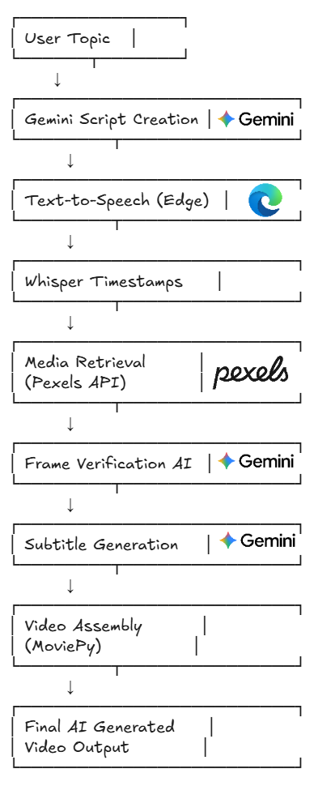

# Multimodal Generative AI Video Pipeline

An automated **Generative AI pipeline** that creates short educational videos by combining large language models, text-to-speech synthesis, media retrieval, and automated video composition.

This project demonstrates how modern AI tools can be orchestrated together to build **end-to-end content generation systems**.

---

## Overview

This pipeline automatically generates educational videos about topics such as flora and fauna.

The workflow includes:

1. **AI Script Generation** using Gemini LLM
2. **Voice Narration** using neural text-to-speech
3. **Subtitle Alignment** using Whisper timestamps
4. **Media Retrieval** from external sources
5. **AI Validation of Visual Frames**
6. **Automated Video Assembly**

The result is a **fully generated vertical video** optimized for platforms like YouTube Shorts or Instagram Reels.

---


## Pipeline Architecture


---

## Key Features

* End-to-end automated AI video generation
* LLM-driven script creation
* Neural text-to-speech narration
* Word-level subtitle synchronization
* Automated media retrieval
* Multimodal AI verification
* Vertical video generation (1080×1920)

---

## Tech Stack

Python
Google Gemini API
Edge TTS
Whisper Timestamped
MoviePy
NumPy
Pillow

---

## Repository Structure

```
multimodal-genai-video-pipeline
│
├── notebooks
│   └── genai_video_generation_pipeline.ipynb
│
├── outputs
│   └── sample_video.mp4
│
├── images
│   └── pipeline_architecture.png
│
├── requirements.txt
└── README.md
```

---

## Installation

Clone the repository:

```
git clone https://github.com/Akhilesh-Ankur09/multimodal-genai-video-pipeline
```

Install dependencies:

```
pip install -r requirements.txt
```

---

## Environment Variables

This project requires API keys.

Set them in **Google Colab Secrets**:

```
GEMINI_KEY_1
GEMINI_KEY_2
GEMINI_KEY_3
GEMINI_KEY_4
PEXELS_API_KEY
```

---

## Example Use Case

This pipeline can be used for:

* automated educational content generation
* AI social media automation
* AI-generated documentary shorts
* automated knowledge videos

---

## Example Output

[▶ Watch the generated video](https://raw.githubusercontent.com/Akhilesh-Ankur09/multimodal-genai-video-pipeline/main/outputs/download%20(5).mp4)
---

## Future Improvements

* AI scene selection optimization
* automated YouTube Shorts publishing
* agent-based workflow orchestration
* improved media relevance scoring

---

## Author

Akhilesh Ankur
Generative AI & Machine Learning Developer
